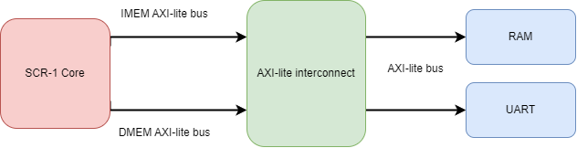

# Our SCR1 sim

Preparing debugging infrastructure for RISCV-based processor ([scr-1](https://github.com/syntacore/scr1) in our case)

### Diagram


### Runs on platforms
- Centos 7 
- Windows 10 22h2 (not compile vpi)

### Dependencies
- QuestaSim or Modelsim
- [openocd](https://openocd.org/) (tested with version 0.12.0)

### Qucik start
```
make build_vpi && make
```
other commads look  in `make help`